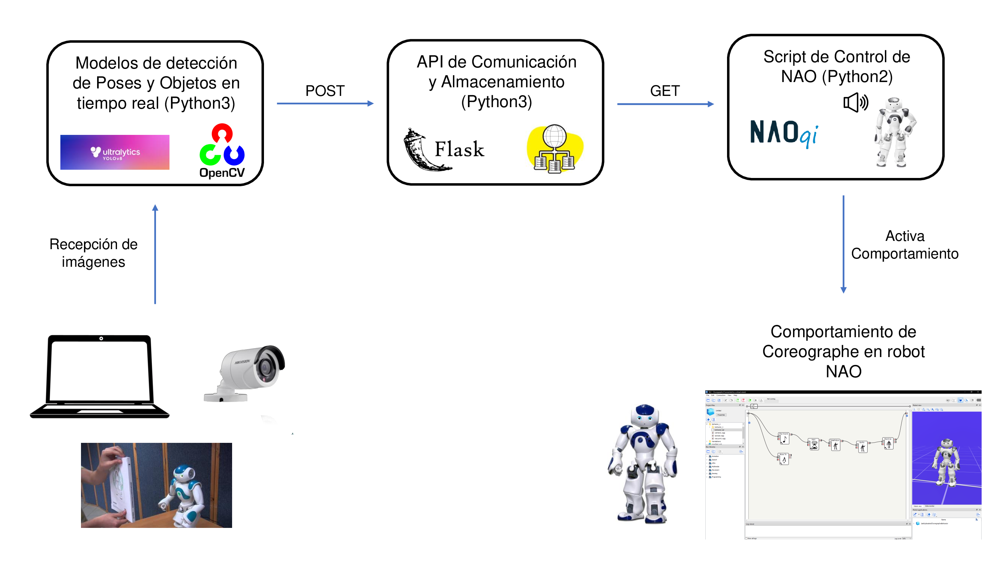

# NaoDanger

**Grupo 4**  
**Integrantes:**
- U202122837 Fernando Samuel Paredes Espinoza
- U202114233 Anthony Hans Tarrillo Ayllón
- U202121973 Andres Joshua Rodriguez Guerrero
- U20201B124 Josafat Larios Mellado

## Descripcion
Este proyecto consiste en detectar posiciones que puedan significar que la persona esta en peligro u objetos peligrosos como lo puede ser un cuchillo. Se ejecutan 2 modelos de deteccion en tiempo real y cuando detectan una situacion peligrosa programada como levantar los brazos o la aparicion de objetos punzocortantes como un cuchillo, estos enviaran una peticion a la API para almacenar que situacion detectaron, seguidamente esta informacion es consultada por el script que controla a NAO para activar el comportamiento instalado en el robot y asi empezar la interaccion.

---

## Diagrama de arquitectura de componentes


### Flujo de la arquitectura

1. **Recepcion de imagenes:** El video puede ser capturado por diferentes dispositivos:
   - Camaras de seguridad
   - Camaras del robot NAO
   - Laptop (como en este caso)
     
2. **Modelo de Deteccion de Poses y Objetos:** Para la ejecucion del modelo se necesita python 3.
   - Ejecuta los modelos de ML, mas especificamente modelos YOLO de ultralitycs. Para los objetos usamos "yolov8s.pt" y para las poses "yolov8n-pose.pt", que juntado con la libreria OpenCV que nos permitira ontrolar      la camara, podremos predecir situaciones peligrosas.
   - Al ser detectada una situacion peligrosa, enviara una peticion POST a la API para almacenar la deteccion.

3. **API de Comunicacion y Almacenamiento:** Para la ejcucion de la API se necesita python3.
   - API REST que actua como intermediario entre el modelo y el robot.
   - POST: Recibe datos de la situacion detectada por el modelo.
   - GET: Manda informacion de la situacion detecada al robot NAO.

4. **Script de control de NAO:** Para la ejecucion se necesita python 2, ya que en esa version esta la libreria naoqi que controla el robot.
   - Consulta a la API de manera periodica para verificar si hay detecciones nuevas.
   - Mediante naoqi, al detectar una situacion, controlamos el robot para que ejecute algunas acciones.

5. **Comportamiento NAO:** Al detectar una situacion peligrosa. el script ejecutara automaticamente el comportamiento previamente instalado en el robot, empezando asi la interaccion del robot ante la situacion detectada.

---

## Instrucciones de Instalación

### Requerimientos
- **Python 3** (para la ejecución de los scripts)
- **Python 2.7** (para el SDK de NAOqi)

### Instalación del Entorno

1. **Instalar el SDK de NAOqi:**
   - Descarga el SDK de [Aldebaran Robotics](https://support.unitedrobotics.group/en/support/solutions/articles/80001033994-nao-v4-v5-naoqi-2-1-4-13-).
   - Instala el SDK en el directorio de tu preferencia.
   - Configurar el path del SDK en las variables de entorno
   
2. **Configurar el entorno de Python 2.7:**
   - Configurar el path de Python2 en las variables de entorno
   - Las siguientes dependencias deben instalarse para este entorno:

```bash
pip2 install opencv-python pillow numpy requests
```
3. **Configurar el entorno de Python 3:**
   - Configurar el path de Python3 en las variables de entorno
   - Las siguientes dependencias deben instalarse para este entorno

```bash
pip install opencv-python numpy torch ultralytics requests flask
```
### Configuración del Robot Nao

1. **Conexión a la Red:**
   - En caso de tener NAO físico, asegurarse de que el robot Nao esté conectado a la misma red que tu computadora.
   - Encuentra la dirección IP del robot Nao desde su interfaz.


### Ejecución

2. **Ejecutar el archivo app.py o en caso contrario el ejecutable NeoDanger.exe**
Dicho programa ejecutara los 3 scripts principales (Pose_detection.py, NaoDanger_detection.py y Response_detection.py)


---

### Recursos Adicionales

**Link del video de demostración:**  
[Demostración en YouTube](https://youtu.be/NsO5Oqmj7ns)

---

