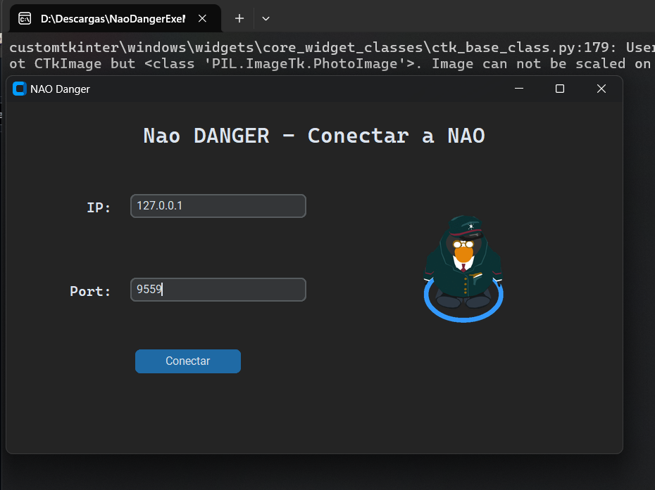

# NaoDanger

**Grupo 4**  
**Integrantes:**
- U202122837 Fernando Samuel Paredes Espinoza
- U202114233 Anthony Hans Tarrillo Ayllón
- U202121973 Andres Joshua Rodriguez Guerrero
- U20201B124 Josafat Larios Mellado

**Descripción:**  
joschua

---
**Diagrama de arquitectura de componentes:**  


---
## Instrucciones de Instalación

### Requerimientos
- **Python 3** (para la ejecución de los scripts)
- **Python 2.7** (para el SDK de NAOqi)

### Instalación del Entorno

1. **Instalar el SDK de NAOqi:**
   - Descarga el SDK de [Aldebaran Robotics](https://support.unitedrobotics.group/en/support/solutions/articles/80001033994-nao-v4-v5-naoqi-2-1-4-13-).
   - Instala el SDK en el directorio de tu preferencia.
   - Configurar el path del SDK en las variables de entorno
   
2. **Configurar el entorno de Python 2.7:**
   - Configurar el path de Python2 en las variables de entorno
   - Las siguientes dependencias deben instalarse para este entorno:

```bash
pip2 install opencv-python pillow numpy requests
```
3. **Configurar el entorno de Python 3:**
   - Configurar el path de Python3 en las variables de entorno
   - Las siguientes dependencias deben instalarse para este entorno

```bash
pip install opencv-python numpy torch ultralytics requests flask
```
### Configuración del Robot Nao

1. **Conexión a la Red:**
   - En caso de tener NAO físico, asegurarse de que el robot Nao esté conectado a la misma red que tu computadora.
   - Encuentra la dirección IP del robot Nao desde su interfaz.


### Ejecución

2. **Ejecutar el archivo app.py o en caso contrario el ejecutable NeoDanger.exe**
Dicho programa ejecutara los 3 scripts principales (Pose_detection.py, NaoDanger_detection.py y Response_detection.py)



---

### Recursos Adicionales

**Link del video de demostración:**  
[Demostración en YouTube](https://youtu.be/NsO5Oqmj7ns)

---

